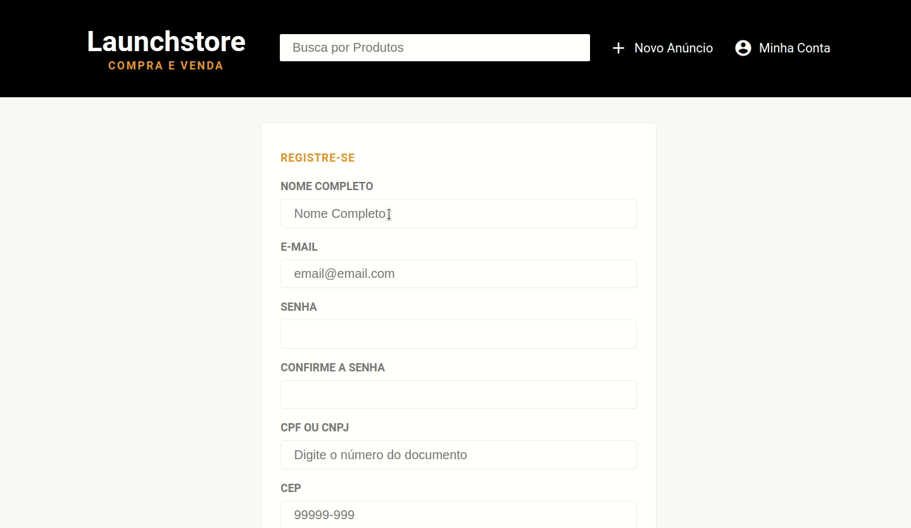

<h1 align="center">
    
</h1>

<h3 align="center">
  Launchstore
</h3>

<p align="center">

  <a href="https://rocketseat.com.br">
    
  </a>

  <a href="./LICENSE" >
    
  </a>
  
  <a href="https://www.linkedin.com/in/diegyohoho/" >
    
  </a>

</p>

<p align="center">
  <a href="https://github.com/diegyohoho/launchbase-04">Início</a>&nbsp;&nbsp;&nbsp;|&nbsp;&nbsp;&nbsp;
  <a href="#módulos">Módulos</a>&nbsp;&nbsp;&nbsp;|&nbsp;&nbsp;&nbsp;
  <a href="#licença">Licença</a>
</p>

<div align="center">
    
</div>

##### Validações Front-end

<div align="center">
    
</div>

#### Módulos:
- [x] Launchstore
- [x] Upload de Imagens
- [x] Listando os Produtos da Launchstore
- [ ] Cadastrando Usuários

#### Tecnologias:
- NodeJS
- Nunjucks
- PostgresSQL 

#### Instalação:

- Configure o [banco de dados](./launchstoredb.sql) launchstoredb no PostgresSQL
- Instale as dependências, executando o seguinte comando na raiz do projeto:

```bash
npm install
```

#### Execução:
- Execute o seguinte comando na raiz do projeto:
```bash
npm start
```

###### Código [aqui](./launchstore)!

## Licença

Esse projeto está sob a licença MIT. Veja o arquivo [LICENSE](./LICENSE) para mais detalhes.
